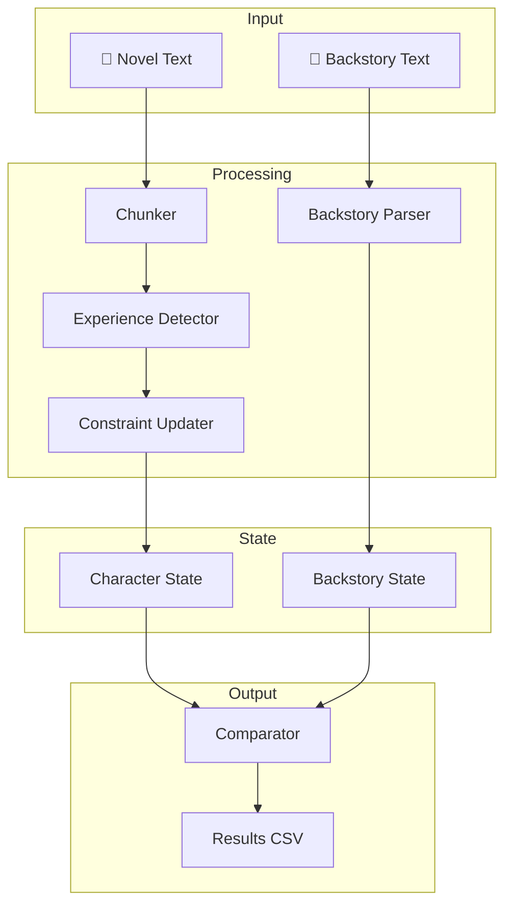
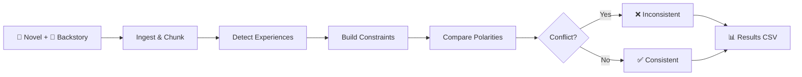

<p align="center">
  
  
  
  
</p>

<h1 align="center">🔍 Narrative Consistency Reasoning System</h1>

<p align="center">
  <strong>A deterministic, explainable AI system for verifying character backstory consistency against full-length novels</strong>
</p>

<p align="center">
  <em>Built for KDS Hackathon Track A — Interpretable Predictions with Evidence-Based Explanations</em>
</p>

---

## 🎯 Problem Statement

Given a **hypothetical backstory** and a **full novel**, determine if the backstory is **consistent** with the character's behavior throughout the narrative.

| Requirement | Description |
|-------------|-------------|
| **Deterministic** | Same inputs always produce identical outputs |
| **Explainable** | Clear, human-readable reasoning for all predictions |
| **Evidence-Based** | References specific text snippets from the novel |
| **Scalable** | Efficiently handles long-form narratives |

---

## 💡 Solution Overview

We model characters as **evolving constraint systems** where behavioral patterns are extracted from narrative experiences and compared against backstory claims.

### Key Features

| Feature | Description |
|---------|-------------|
| 🔄 **End-to-End Pipeline** | Complete ingestion to results generation |
| 🎯 **Constraint-Based Modeling** | Characters as multi-dimensional constraint systems |
| 📈 **Incremental Learning** | Constraints evolve through narrative experiences |
| ⚖️ **Polarity Detection** | Positive/negative pattern classification |
| ⚠️ **Conflict Analysis** | Severity-based inconsistency detection |
| 📎 **Evidence Retrieval** | Snippet extraction for explainability |

---

## 🏗️ System Architecture



---

## 🔄 Pipeline Workflow



---

## 🎚️ Constraint Dimensions

The system tracks three core behavioral dimensions:

| Dimension | Keywords | Description |
|-----------|----------|-------------|
| **Violence** | `violence`, `fight`, `attack`, `conflict`, `battle` | Fighting, conflict, aggression patterns |
| **Authority** | `authority`, `leader`, `rule`, `obey`, `defy` | Leadership, obedience, defiance behaviors |
| **Trust** | `trust`, `betray`, `rely`, `bond`, `distrust` | Relationships, betrayal, reliance dynamics |

Each constraint has:
- **Polarity**: Positive (engages) or Negative (avoids)
- **Strength**: Confidence level (0.0 - 1.0)
- **Evidence**: References to supporting text

---

## 🚀 Quick Start

```bash
# Clone and setup
git clone https://github.com/Naveeeya/KDS_Hackathon.git
cd KDS_Hackathon/project

# Create virtual environment
python -m venv .venv
source .venv/bin/activate  # Windows: .venv\Scripts\activate

# Install and run
pip install -r requirements.txt
python pathway_pipeline/orchestration.py
```

---

## 📖 Usage

### Input Files

```
data/
├── novels/
│   └── your_novel.txt          # Full novel text
└── backstories/
    └── your_backstory.txt      # Backstory claims
```

### Output Format

The system generates `results/results.csv`:

| Column | Description |
|--------|-------------|
| `prediction` | 0 (inconsistent) or 1 (consistent) |
| `decision` | "inconsistent" or "consistent" |
| `reason` | Human-readable explanation |
| `conflict_details` | Detailed constraint comparisons |

---

## 📝 Example

**Novel:**
```
He always avoided violence.
He refused to fight even when threatened.
```

**Backstory:**
```
He grew up enjoying violence.
He believed fighting was the solution.
```

**Result:** `❌ INCONSISTENT` — Story shows negative violence polarity, backstory claims positive.

---

## 🧪 Testing

```bash
python -m pytest tests/ -v
```

---

## 📁 Project Structure

```
project/
├── pathway_pipeline/     # Data ingestion & orchestration
├── narrative/           # Text processing & experience detection
├── constraints/         # Core constraint logic & comparison
├── backstory/           # Backstory parsing
├── evidence/            # Snippet retrieval
├── tests/              # Unit tests
├── data/               # Input texts
└── results/            # Output CSVs
```

---

## 📈 Performance

| Metric | Value |
|--------|-------|
| **Determinism** | 100% (rule-based) |
| **Complexity** | O(n) linear |
| **Speed** | Sub-second for typical novels |

---

## 📄 License

Developed for the **KDS Hackathon**. See repository license for details.

---

<p align="center">
  <strong>Made with ❤️ for KDS Hackathon Track A</strong>
</p>
