<p align="center">
  
  
  
  
</p>

<h1 align="center">🔍 Narrative Consistency Reasoning System</h1>

<p align="center">
  <strong>A deterministic, explainable AI system for verifying character backstory consistency against full-length novels</strong>
</p>

<p align="center">
  <em>Built for KDS Hackathon Track A — Interpretable Predictions with Evidence-Based Explanations</em>
</p>

---

## 📋 Table of Contents

- [Problem Statement](#-problem-statement)
- [Solution Overview](#-solution-overview)
- [System Architecture](#-system-architecture)
- [Pipeline Workflow](#-pipeline-workflow)
- [Core Components](#-core-components)
- [Data Structures](#-data-structures)
- [Constraint Dimensions](#-constraint-dimensions)
- [Installation](#-installation)
- [Usage](#-usage)
- [How It Works](#-how-it-works)
- [Example Walkthrough](#-example-walkthrough)
- [Testing](#-testing)
- [Configuration Guide](#-configuration-guide)
- [Performance](#-performance)
- [Project Structure](#-project-structure)
- [Contributing](#-contributing)
- [License](#-license)

---

## 🎯 Problem Statement

Given a **hypothetical backstory** and a **full novel**, determine if the backstory is **consistent** with the character's behavior throughout the narrative.

### Requirements

| Requirement | Description |
|-------------|-------------|
| **Deterministic** | Same inputs always produce identical outputs |
| **Explainable** | Clear, human-readable reasoning for all predictions |
| **Evidence-Based** | References specific text snippets from the novel |
| **Scalable** | Efficiently handles long-form narratives |

### The Challenge

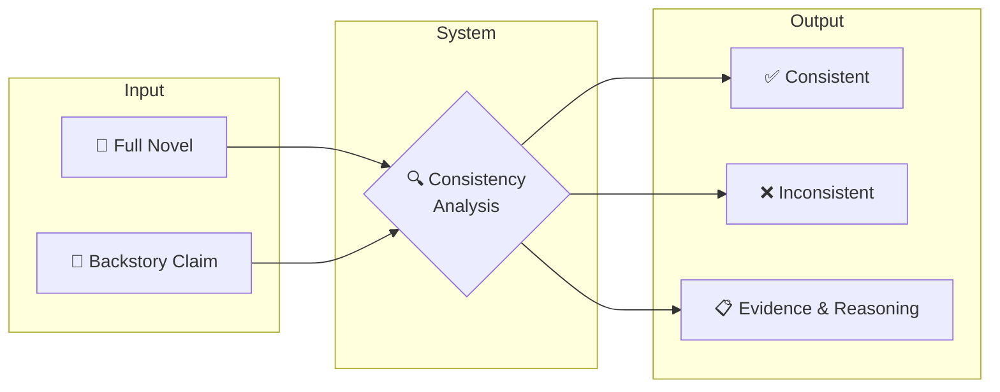

---

## 💡 Solution Overview

We model characters as **evolving constraint systems** where behavioral patterns are extracted from narrative experiences and compared against backstory claims.

### Key Innovations

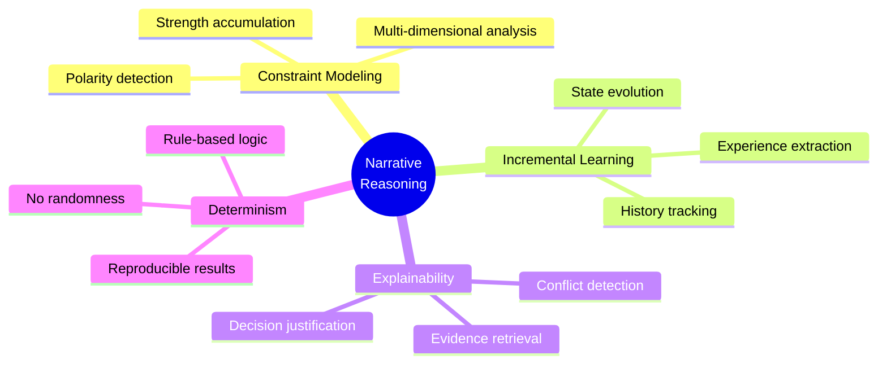

### Feature Highlights

| Feature | Description |
|---------|-------------|
| 🔄 **End-to-End Pipeline** | Complete ingestion to results generation |
| 🎯 **Constraint-Based Modeling** | Characters as multi-dimensional constraint systems |
| 📈 **Incremental Learning** | Constraints evolve through narrative experiences |
| ⚖️ **Polarity Detection** | Positive/negative pattern classification |
| ⚠️ **Conflict Analysis** | Severity-based inconsistency detection |
| 📎 **Evidence Retrieval** | Snippet extraction for explainability |
| 📊 **CSV Outputs** | Structured results for evaluation |

---

## 🏗️ System Architecture

### High-Level Architecture

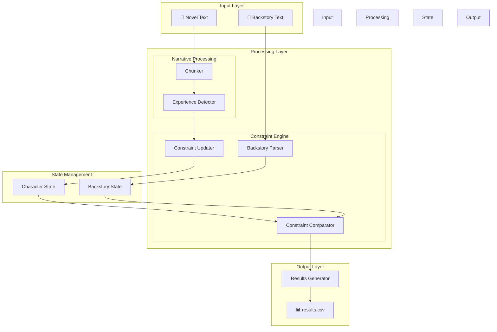

### Component Diagram

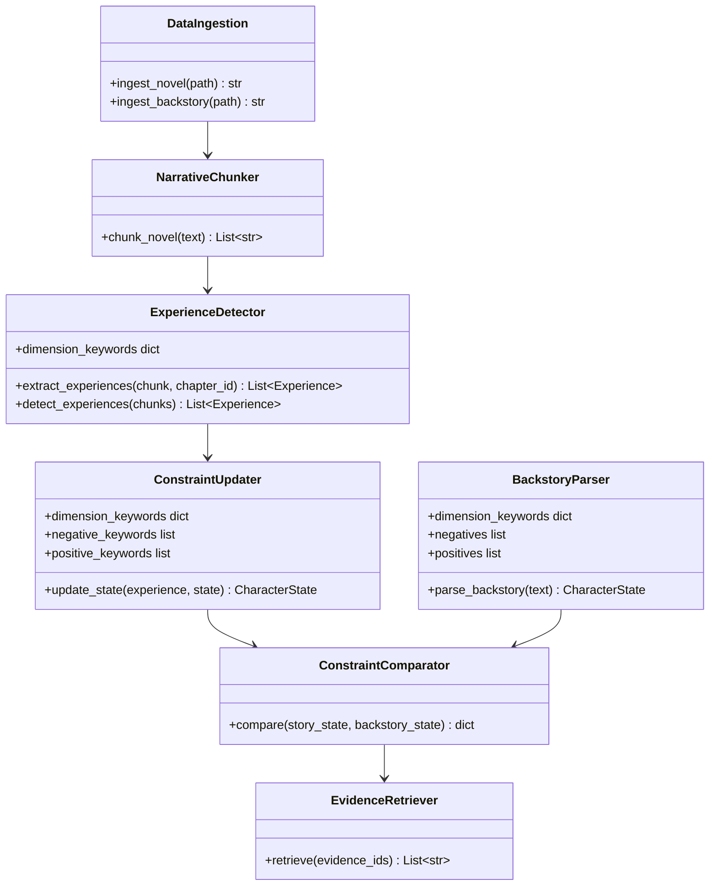

---

## 🔄 Pipeline Workflow

### Main Processing Flow

```mermaid
flowchart TD
    subgraph Phase1[Phase 1: Ingestion]
        A1[Start] --> A2[Load Novel Text]
        A2 --> A3[Load Backstory Text]
    end
    
    subgraph Phase2[Phase 2: Narrative Processing]
        A3 --> B1[Split into Chunks]
        B1 --> B2[Detect Experiences]
        B2 --> B3{Experience Found?}
        B3 -->|Yes| B4[Extract Dimension & Polarity]
        B3 -->|No| B5[Skip Sentence]
        B4 --> B6[Create Experience Object]
        B5 --> B2
        B6 --> B7[More Chunks?]
        B7 -->|Yes| B2
        B7 -->|No| C1
    end
    
    subgraph Phase3[Phase 3: Constraint Evolution]
        C1[Initialize Empty CharacterState]
        C1 --> C2{Process Experience}
        C2 --> C3[Detect Dimension Keywords]
        C3 --> C4[Determine Polarity]
        C4 --> C5[Update Constraint Strength]
        C5 --> C6[Add Evidence ID]
        C6 --> C7{More Experiences?}
        C7 -->|Yes| C2
        C7 -->|No| D1
    end
    
    subgraph Phase4[Phase 4: Backstory Analysis]
        D1[Parse Backstory Sentences]
        D1 --> D2[Extract Dimension Keywords]
        D2 --> D3[Determine Polarity]
        D3 --> D4[Create Backstory Constraints]
    end
    
    subgraph Phase5[Phase 5: Comparison & Decision]
        D4 --> E1[Compare Story vs Backstory]
        E1 --> E2{Polarity Match?}
        E2 -->|Yes| E3[Mark Consistent]
        E2 -->|No| E4[Calculate Severity]
        E4 --> E5[Record Conflict]
        E3 --> E6[Generate Decision]
        E5 --> E6
    end
    
    subgraph Phase6[Phase 6: Output]
        E6 --> F1[Compile Results]
        F1 --> F2[Write CSV]
        F2 --> F3[End]
    end
    
    style Phase1 fill:#e3f2fd
    style Phase2 fill:#fff8e1
    style Phase3 fill:#fce4ec
    style Phase4 fill:#e8f5e9
    style Phase5 fill:#f3e5f5
    style Phase6 fill:#e0f2f1
```

### Decision Logic Flow

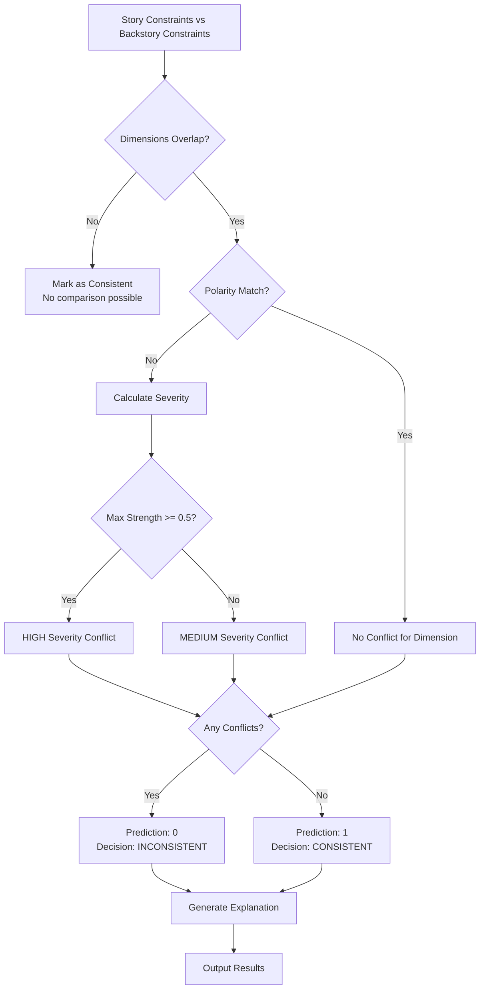

---

## 🧩 Core Components

### 1. Data Ingestion (`pathway_pipeline/ingestion.py`)

Handles loading of novel and backstory texts from various formats.

```python
# Supports: .txt, .pdf formats
ingestion = DataIngestion()
novel_text = ingestion.ingest_novel("data/novels/novel.txt")
backstory_text = ingestion.ingest_backstory("data/backstories/backstory.txt")
```

### 2. Narrative Chunker (`narrative/chunker.py`)

Splits large novels into processable semantic chunks.

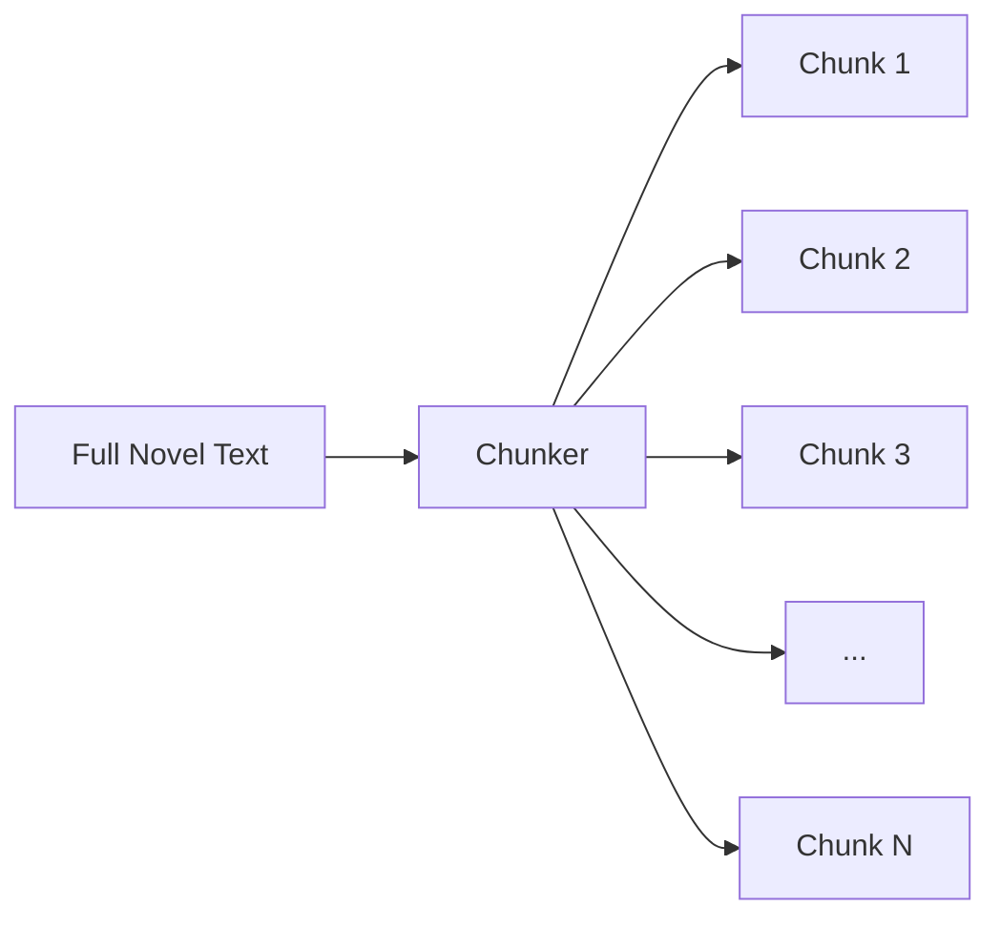

### 3. Experience Detector (`narrative/experience_detector.py`)

Extracts meaningful character experiences using keyword-based detection.

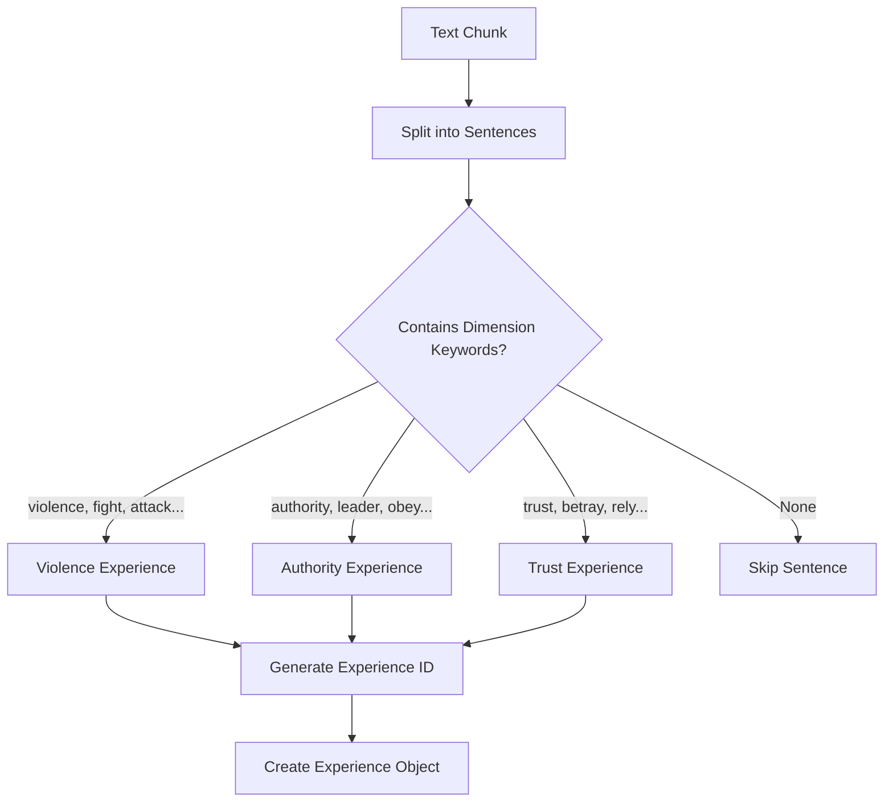

### 4. Constraint Updater (`constraints/updater.py`)

Evolves character state based on detected experiences.

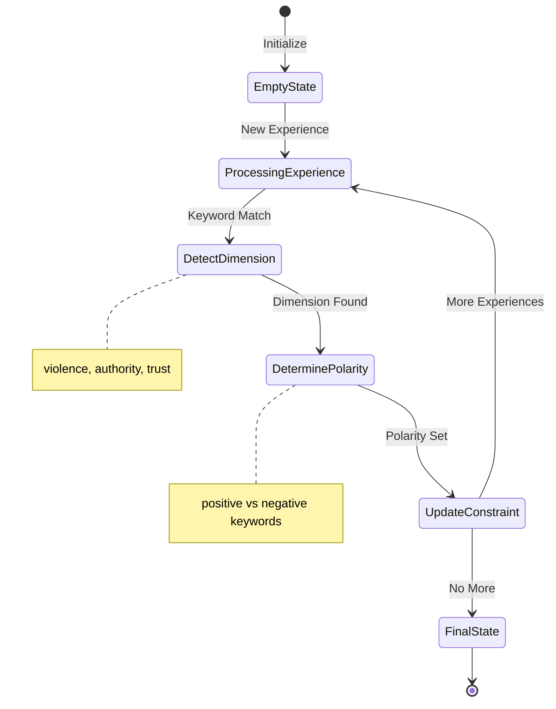

### 5. Backstory Parser (`backstory/parser.py`)

Converts backstory text into constraint representation.

### 6. Constraint Comparator (`constraints/comparator.py`)

Analyzes compatibility and detects conflicts between story and backstory constraints.

### 7. Evidence Retriever (`evidence/retriever.py`)

Extracts supporting text snippets for explainability.

---

## 📦 Data Structures

### Core Schema

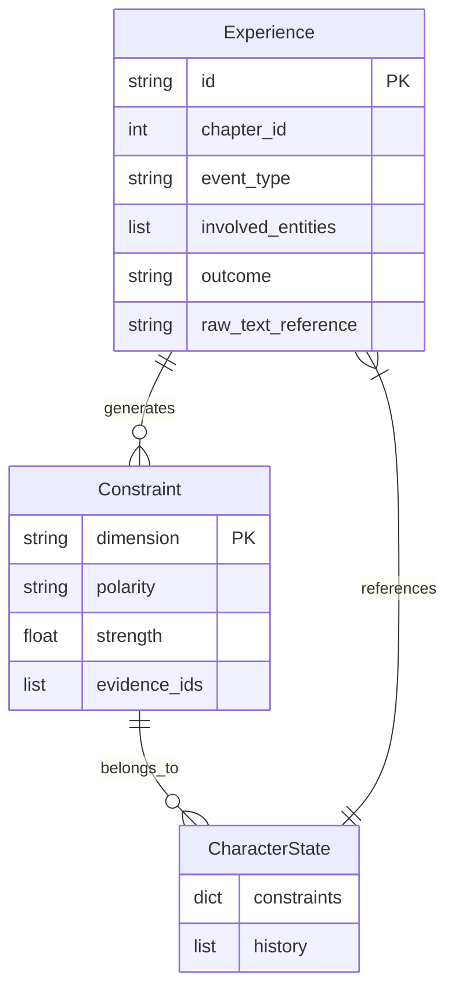

### Constraint Structure

| Field | Type | Description |
|-------|------|-------------|
| `dimension` | string | Category (violence, trust, authority) |
| `polarity` | string | "positive" or "negative" |
| `strength` | float | Confidence level (0.0 - 1.0) |
| `evidence_ids` | list | References to supporting experiences |

---

## 🎚️ Constraint Dimensions

The system currently tracks three core behavioral dimensions:

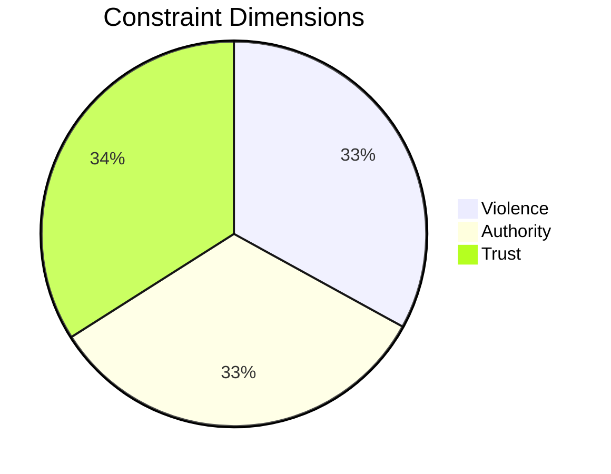

### Dimension Details

| Dimension | Keywords | Description |
|-----------|----------|-------------|
| **Violence** | `violence`, `fight`, `attack`, `conflict`, `battle` | Fighting, conflict, aggression patterns |
| **Authority** | `authority`, `leader`, `rule`, `obey`, `defy` | Leadership, obedience, defiance behaviors |
| **Trust** | `trust`, `betray`, `rely`, `bond`, `distrust` | Relationships, betrayal, reliance dynamics |

### Polarity Detection

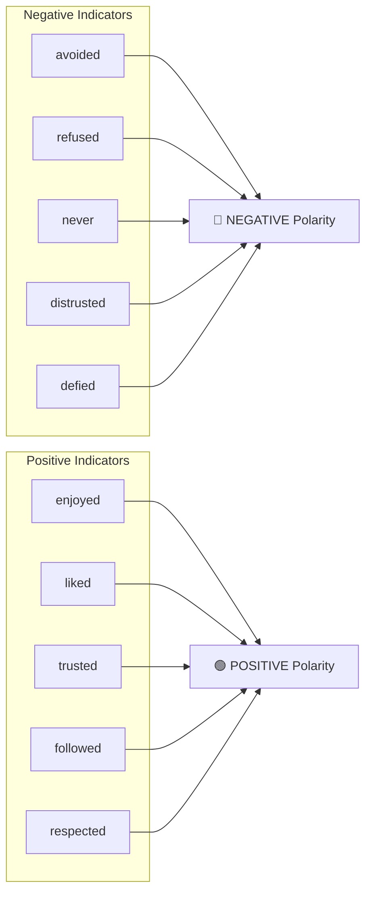

---

## 🚀 Installation

### Prerequisites

- **Python 3.9+**
- **pip** (Python package manager)
- Virtual environment (recommended)

### Quick Setup

```bash
# 1. Clone repository
git clone https://github.com/your-repo/kds-hackathon.git
cd kds-hackathon/project

# 2. Create virtual environment
python -m venv .venv

# 3. Activate virtual environment
source .venv/bin/activate      # macOS/Linux
# .venv\Scripts\activate        # Windows

# 4. Install dependencies
pip install -r requirements.txt
```

### Dependencies

| Package | Purpose |
|---------|---------|
| `pathway` | Data processing framework |
| `pandas` | Results serialization |
| `pdfplumber` | PDF text extraction |
| `pytest` | Testing framework |
| `openai` | LLM extraction (optional) |

---

## 📖 Usage

### Basic Execution

```bash
# Run the full pipeline
python pathway_pipeline/orchestration.py
```

### Input Files

Place your input files in the `data/` directory:

```
data/
├── novels/
│   └── your_novel.txt          # Full novel text
└── backstories/
    └── your_backstory.txt      # Backstory claims
```

### Output Format

The system generates `results/results.csv`:

| Column | Description |
|--------|-------------|
| `prediction` | 0 (inconsistent) or 1 (consistent) |
| `decision` | "inconsistent" or "consistent" |
| `reason` | Human-readable explanation |
| `trigger_summary` | Summary of conflicts detected |
| `checked_dimensions` | Dimensions that were analyzed |
| `conflict_dimensions` | Dimensions with conflicts |
| `conflict_details` | Detailed constraint comparisons |

---

## ⚙️ How It Works

### Strength Accumulation

Each time evidence for a constraint is found, strength increases:

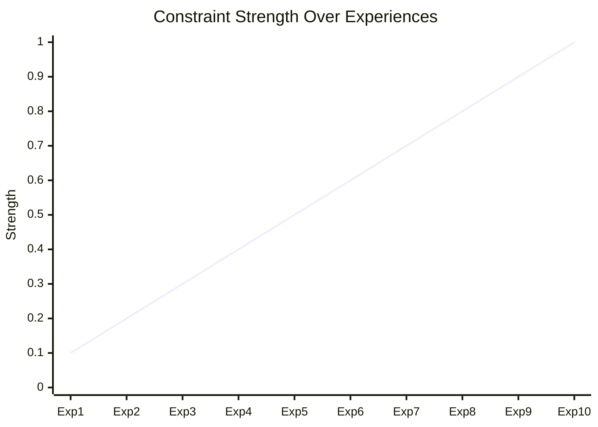

### Conflict Severity Calculation

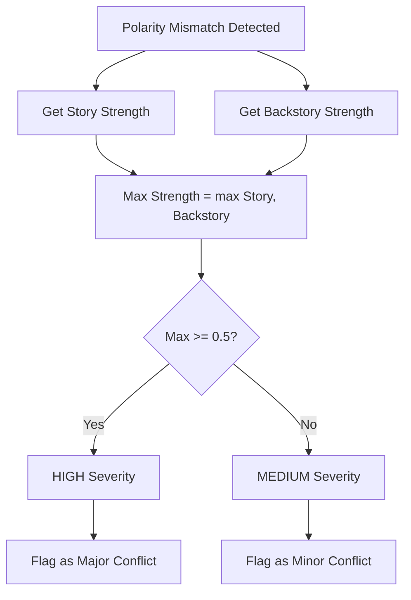

---

## 📝 Example Walkthrough

### Sample Novel Text

```
He always avoided violence.
He refused to fight even when threatened.
He chose to walk away from conflicts.
```

### Sample Backstory

```
He grew up enjoying violence.
He believed fighting was the solution to problems.
```

### Processing Steps

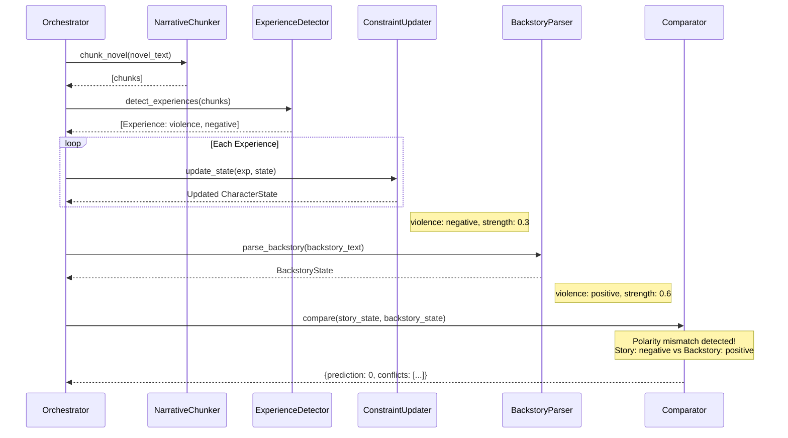

### Result

```csv
prediction,decision,reason,trigger_summary,checked_dimensions,conflict_dimensions,conflict_details
0,inconsistent,One or more constraint conflicts exceeded severity thresholds.,1 conflicts detected.,,violence,Story violence: negative (0.3) | Backstory violence: positive (0.6)
```

**Interpretation:** The backstory claims the character enjoyed violence, but the novel shows consistent avoidance of violence → **INCONSISTENT**

---

## 🧪 Testing

### Run Test Suite

```bash
# Run all tests with verbose output
python -m pytest tests/ -v

# Run specific test file
python -m pytest tests/test_constraints.py -v

# Run with coverage report
python -m pytest tests/ --cov=. --cov-report=html
```

### Test Coverage

| Component | Tests |
|-----------|-------|
| Constraint Comparison | ✅ Polarity mismatch detection |
| Conflict Severity | ✅ Threshold calculations |
| Evidence Collection | ✅ Snippet retrieval |

---

## 🔧 Configuration Guide

### Adding New Dimensions

1. **Update dimension keywords** in `constraints/updater.py`:

```python
self.dimension_keywords = {
    "violence": ["violence", "fight", "attack"],
    "authority": ["authority", "leader", "rule"],
    "trust": ["trust", "betray", "rely"],
    "loyalty": ["loyal", "betrayal", "allegiance"]  # NEW
}
```

2. **Mirror changes** in `narrative/experience_detector.py` and `backstory/parser.py`

3. **Test** with sample texts

### Modifying Polarity Keywords

Edit keyword lists in `ConstraintUpdater`:

```python
self.negative_keywords = ['avoided', 'refused', 'never', ...]
self.positive_keywords = ['enjoyed', 'liked', 'trusted', ...]
```

---

## 📈 Performance

### Characteristics

| Metric | Value |
|--------|-------|
| **Determinism** | 100% (rule-based, no randomness) |
| **Complexity** | O(n) linear with text length |
| **Memory** | Sequential chunk processing |
| **Speed** | Sub-second for typical novels |

### Scalability

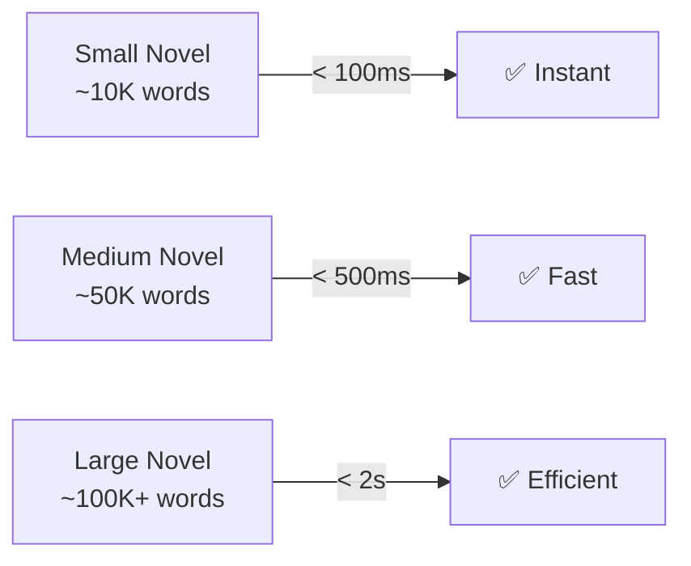

---

## 📁 Project Structure

```
project/
├── 📂 pathway_pipeline/           # Data ingestion & orchestration
│   ├── __init__.py
│   ├── ingestion.py              # File reading utilities
│   └── orchestration.py          # Main pipeline entry point
│
├── 📂 narrative/                  # Text processing & experience detection
│   ├── __init__.py
│   ├── chunker.py                # Novel text chunking
│   └── experience_detector.py    # Experience extraction
│
├── 📂 constraints/                # Core constraint logic
│   ├── __init__.py
│   ├── schema.py                 # Data structures (Experience, Constraint, CharacterState)
│   ├── updater.py                # Constraint evolution
│   └── comparator.py             # Conflict detection
│
├── 📂 backstory/                  # Backstory parsing
│   ├── __init__.py
│   └── parser.py                 # Convert backstory to constraints
│
├── 📂 evidence/                   # Snippet retrieval
│   ├── __init__.py
│   └── retriever.py              # Evidence extraction
│
├── 📂 tests/                      # Unit tests
│   ├── __init__.py
│   └── test_constraints.py       # Constraint tests
│
├── 📂 data/                       # Input texts
│   ├── novels/                   # Novel files
│   └── backstories/              # Backstory files
│
├── 📂 results/                    # Output CSVs
│   └── results.csv               # Pipeline output
│
├── requirements.txt              # Python dependencies
└── README.md                     # This file
```

---

## 🤝 Contributing

We welcome contributions! Here's how to get started:

1. **Fork** the repository
2. **Create** a feature branch (`git checkout -b feature/amazing-feature`)
3. **Add tests** for new functionality
4. **Ensure** all tests pass (`pytest tests/ -v`)
5. **Commit** your changes (`git commit -m 'Add amazing feature'`)
6. **Push** to the branch (`git push origin feature/amazing-feature`)
7. **Open** a Pull Request

### Code Style

- Follow PEP 8 guidelines
- Add docstrings to all functions
- Include type hints where possible

---

## 📄 License

This project is developed for the **KDS Hackathon**. See repository license for details.

---

## 🙏 Acknowledgments

- Built for **Track A** of the KDS Hackathon
- Uses **Pathway** for data processing framework
- Inspired by constraint-based reasoning systems

---

<p align="center">
  <strong>Made with ❤️ for KDS Hackathon</strong>
</p>

<p align="center">
  <a href="#-table-of-contents">⬆️ Back to Top</a>
</p>
