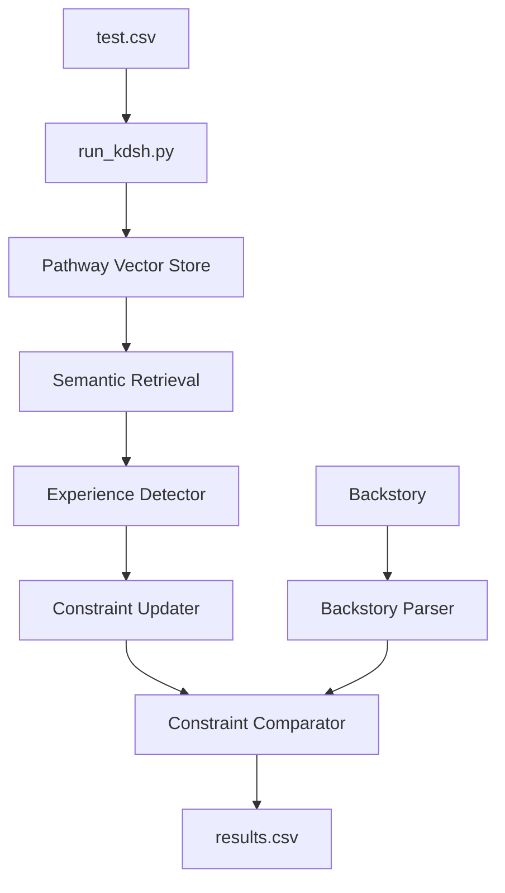

# KDSH 2026 - Narrative Consistency Analysis

## Track A: Systems Reasoning with NLP and Generative AI

A constraint-based narrative consistency reasoning system that determines if a hypothetical character backstory is consistent with their behavior throughout a full-length novel.

## 🚀 Quick Start

```bash
cd project
python3 run_kdsh.py
```

Results are saved to `results/results.csv` in format: `story_id,prediction,rationale`

## 🏗️ Architecture



## 🔑 Key Features

### 1. Pathway Integration
- **Vector Store**: TF-IDF based semantic similarity for document retrieval
- **Document Processor**: Streaming-ready chunking with overlap
- **Character Filtering**: Retrieves passages mentioning specific characters

### 2. Constraint-Based Reasoning
- **6 Behavioral Dimensions**: violence, authority, trust, courage, loyalty, morality
- **Polarity Detection**: Classifies patterns as positive/negative
- **Evidence Dominance**: Threshold-based conflict detection (0.3 ratio)

### 3. Explainable Output
```csv
story_id,prediction,rationale
95,1,No meaningful conflicts. All constraint polarities align.
2,0,Polarity mismatch in [trust]. HIGH severity with evidence dominance.
```

## 📁 Project Structure

```
project/
├── run_kdsh.py              # Main batch processor
├── pathway_pipeline/
│   ├── vector_store.py      # Pathway semantic retrieval
│   ├── ingestion.py         # Data loading
│   └── orchestration.py     # Single-file pipeline
├── narrative/
│   ├── chunker.py           # Text chunking
│   └── experience_detector.py
├── constraints/
│   ├── schema.py            # Data structures
│   ├── updater.py           # Constraint evolution
│   ├── comparator.py        # Conflict detection
│   └── parser.py            # Backstory parsing
├── evidence/
│   └── dossier_generator.py # Detailed evidence linkage
└── results/
    └── results.csv          # Final predictions
```

## 🔧 Technical Approach

### Long Context Handling
1. **Semantic Chunking**: Novels split into 2000-word overlapping chunks
2. **Pathway Vector Store**: TF-IDF indexing for efficient retrieval
3. **Character-Based Filtering**: Focus analysis on character-relevant passages

### Decision Logic
- Extract behavioral experiences from novel
- Parse backstory claims into constraints
- Compare polarities across 6 dimensions
- **Contradict (0)**: HIGH severity conflict with evidence dominance ≥ 30%
- **Consistent (1)**: No meaningful polarity mismatches

## 📊 Results Format
| Column | Description |
|--------|-------------|
| story_id | Sample ID from test.csv |
| prediction | 0 (contradict) or 1 (consistent) |
| rationale | Brief technical explanation |

## 🛠️ Requirements
```
pathway>=0.2.0
pandas
pytest
pdfplumber
```

## 🎯 Novel Contribution
- **Constraint Evolution Model**: Characters as evolving constraint systems
- **Evidence Dominance Scoring**: Quantitative conflict threshold
- **Pathway Integration**: Semantic retrieval for long narratives
